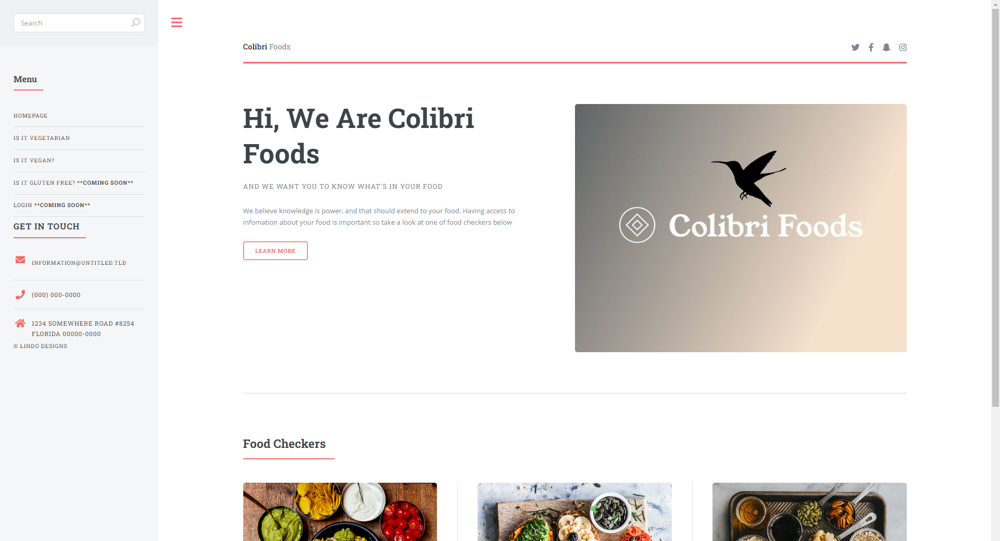

# Colibri Foods
Dynamic webpage that lets you input a barcode and return vegan or vegetarian information. The data is from the Open Food Facts API

**Link to project:** https://colibrifoods.netlify.app/

**Link to API** https://world.openfoodfacts.org/

<< Test Barcode: 044000032029 >>

## How It's Made:

**Tech used:** HTML, CSS, JavaScript, Open Food Facts API

Page was built with HTML, CSS, Javascript. The API used is linked above

## Lessons Learned:

Great experience drawing from the API and populating the data in to a table 

